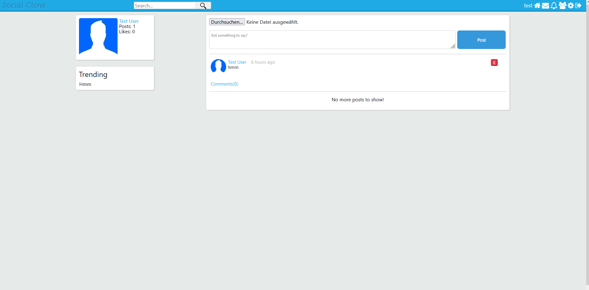

# Social Media Clone
Full-stack Social Media application (basically Social Media clone) with PHP, JS, MySQL

Users can sign up, create posts and upload images, like posts, comment on posts, chat with other users, see notifications and user profiles and add users as friends, change user settings, search for users with AJAX and much more.

* Basically possible to do everything, that users can do on a simple social media platform.

The most complete PHP application.

Original Projekt by: https://github.com/ristotoldsep/

Reverse Engineering: MySQL Database [by Eisbaer]
Fix MySQL register save error: [by Xevrac]

Login: User/Mail: test@test.loc Password: test 

## Project images

### Newsfeed

* Users can create posts, add images, add Youtube links that get converted to embed boxes

* Users can post on friends profiles

* Users can search for registered users without reloading the page

* Users can have real-time conversations with other users, texts have a timestamp & "Seen" feature

* Users can see their received and sent friend requests

* Users can search for users to send a text via AJAX

* Users can change their account settings

* Messages and notifications have a dropdown window handled with AJAX
